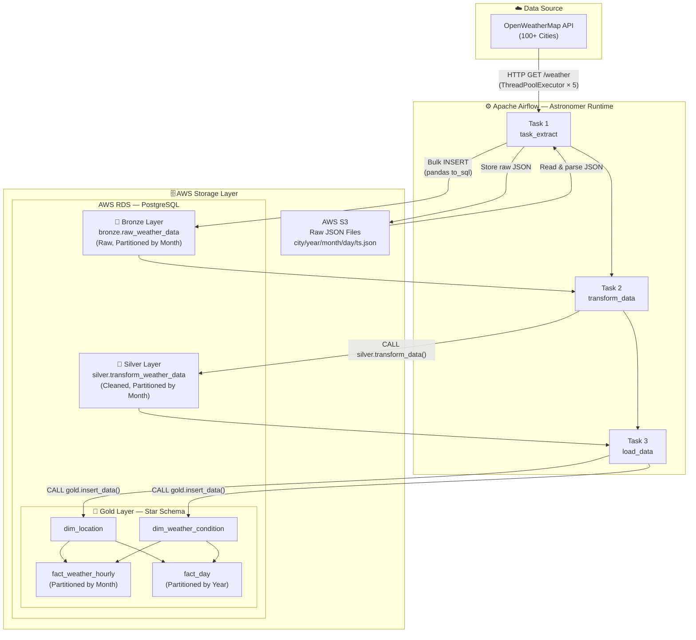

# 🌤️ Real-Time Global Weather Data Pipeline

> An end-to-end batch data pipeline that automatically collects, processes, and warehouses real-time weather data for **100+ global cities** every hour — built with a production-grade **Medallion Architecture** on AWS, orchestrated by **Apache Airflow**.

[](https://airflow.apache.org/)
[](https://aws.amazon.com/)
[](https://www.postgresql.org/)
[](https://www.python.org/)
[](https://www.docker.com/)

---

## 📌 Project Overview

### Business / Technical Objective

The goal of this project is to **build a fully automated, fault-tolerant data pipeline** that:

1. **Collects** real-time weather readings from the OpenWeatherMap API for 100+ cities worldwide.
2. **Stages** raw JSON payloads immutably in AWS S3 as a data lake, ensuring replayability.
3. **Processes** data through a **Medallion (Bronze → Silver → Gold)** layering strategy on AWS RDS (PostgreSQL) to progressively improve data quality.
4. **Serves** a clean, analytics-ready Star Schema that can directly feed BI dashboards or ML feature stores.
5. **Self-maintains** its own database partitions annually with zero manual intervention.

This project demonstrates a realistic, industry-standard approach to building a data warehouse pipeline — from raw API ingestion all the way to a queryable dimensional model.

---

## 🏗️ Data Pipeline Architecture

### System Flow Diagram



### Medallion Architecture Explained

| Layer | Schema | Key Tables | Purpose |
|---|---|---|---|
| 🥉 **Bronze** | `bronze` | `raw_weather_data` | Immutable raw records. What came from the API, nothing more. Partitioned by month for query performance. |
| 🥈 **Silver** | `silver` | `transform_weather_data` | Cleaned, typed, and standardized data. Duplicates removed, timestamps normalized. |
| 🥇 **Gold** | `gold` | `dim_location`, `dim_weather_condition`, `fact_weather_hourly`, `fact_day` | Analytics-ready Star Schema. Optimized for aggregation queries (e.g., avg temperature by city per day). |

---

## ⚙️ Tech Stack & Design Rationale

> *A great engineer doesn't just pick a tool — they understand the trade-offs.*

### 🔷 Apache Airflow (Astronomer Runtime)

| Aspect | Detail |
|---|---|
| **Role** | Pipeline orchestrator. Schedules, monitors, and retries all ETL tasks. |
| **Why Airflow?** | Airflow's DAG-as-code model makes the pipeline **version-controllable** and reviewable in PRs — unlike cron jobs or GUI-based schedulers. The task dependency graph (`extract >> transform >> load`) guarantees that downstream tasks only run when upstream tasks succeed, preventing silent data corruption. |
| **Why Astronomer?** | Astronomer provides a production-hardened Airflow runtime with a single CLI (`astro dev start`) that spins up a fully containerized local environment. This eliminates "works on my machine" issues entirely. |
| **Trade-off** | Airflow is heavyweight for simple pipelines. For this scale, a cron + Python script would work, but Airflow was chosen intentionally to practice production patterns. |

### 🔷 Python + Pandas + concurrent.futures

| Aspect | Detail |
|---|---|
| **Role** | Data extraction, transformation logic, and parallel API calls. |
| **Why Pandas?** | `pandas.DataFrame` is the ideal structure for the cleansing step — type casting, null handling (`replace(np.nan, None)`), column renaming, and bulk database insertion (`df.to_sql(..., method='multi')`) are all single-line operations. For the data volume at this scale (~100 rows/hour), in-memory processing with Pandas is perfectly adequate and far simpler than spinning up Spark. |
| **Why ThreadPoolExecutor?** | API calls are **I/O-bound**, not CPU-bound. Using a thread pool (5 workers) allows concurrent HTTP requests to the OpenWeatherMap API, reducing the extraction time from ~500 seconds (sequential) to ~100 seconds — a 5× speedup without the complexity of async/await. |
| **Trade-off** | Pandas loads all data into memory. If the city list scaled to 10,000+, this would be replaced with a streaming/chunked approach or PySpark. |

### 🔷 AWS S3 (Object Storage / Data Lake)

| Aspect | Detail |
|---|---|
| **Role** | Immutable raw data store. Every API response is saved as a JSON file before any transformation occurs. |
| **Why S3?** | S3 acts as the **single source of truth** for raw data. If a bug is found in the transformation logic, the raw JSON files allow us to **replay the pipeline from the beginning** without re-calling the API. This separation of storage and compute is a core data engineering best practice. The path structure `{city}/{year}/{month}/{day}/{unix_timestamp}.json` also naturally enables Hive-style partitioning for future Athena/Glue queries. |
| **Trade-off** | Adds slight latency (write then read vs. direct processing) but the replayability benefit far outweighs this cost. |

### 🔷 AWS RDS — PostgreSQL

| Aspect | Detail |
|---|---|
| **Role** | Managed relational database hosting all three Medallion layers. |
| **Why PostgreSQL?** | The weather data is **highly structured** with a well-defined schema, making a relational DB the right fit. PostgreSQL's native support for **table partitioning by range** (`PARTITION BY RANGE`) is critical here — it allows querying `fact_weather_hourly` for a specific month without scanning the entire table. PostgreSQL's **stored procedures** are also used to encapsulate complex transformation logic in the Silver and Gold layers, keeping the Python code thin and pushing computation closer to the data. |
| **Why RDS (managed)?** | Automated backups, patching, and Multi-AZ failover — removing infrastructure overhead so the focus stays on the data pipeline itself. |
| **Trade-off** | RDS has an ongoing cost. For a purely local project, a local PostgreSQL container would suffice. |

### 🔷 Docker (via Astronomer)

| Aspect | Detail |
|---|---|
| **Role** | Containerizes the entire Airflow environment (webserver, scheduler, triggerer, database). |
| **Why Docker?** | Guarantees **100% reproducibility**. Any recruiter or collaborator can clone this repo and run `astro dev start` to get an identical environment — no Python version conflicts, no missing system libraries, no OS-specific bugs. |

---

## 🔄 Airflow DAGs

### DAG 1: `weather_dag` — Hourly ETL

```
[task_extract] ──► [transform_data] ──► [load_data]
```

| Property | Value |
|---|---|
| Schedule | `@hourly` |
| Catchup | `False` |
| Tags | `weather`, `aws` |

| Task | What it does |
|---|---|
| `task_extract` | Spawns 5 threads to call OpenWeatherMap API concurrently for all 100 cities. Each response is saved to S3, then read back and bulk-inserted into `bronze.raw_weather_data` via `pandas.to_sql()`. |
| `transform_data` | Calls stored procedure `silver.transform_data()` — all transformation logic lives in SQL, versioned in `include/sql/silver/create_producers.sql`. |
| `load_data` | Calls stored procedure `gold.insert_data()` which performs upserts into `dim_location`, `dim_weather_condition`, and inserts into the two fact tables. Returns row counts for each operation as an audit log. |

### DAG 2: `create_annual_partitions_dag` — Yearly Maintenance

| Property | Value |
|---|---|
| Schedule | `0 0 25 12 *` (Dec 25 every year) |
| Tags | `weather`, `maintenance` |

Runs automatically every December 25th to **pre-create all monthly partitions** for the coming year across Bronze, Silver, and Gold layers. This prevents `no partition of relation found` errors at year rollover without any manual DBA intervention.

---

## 🗂️ Project Structure

```
weather-pipeline/
├── dags/
│   ├── weather_api.py              # DAG 1: Hourly ETL pipeline
│   └── create_partitions.py        # DAG 2: Annual partition maintenance
│
├── include/
│   ├── config/
│   │   └── .env                    # Local credentials (not committed)
│   │
│   ├── scripts/                    # Pure Python ETL logic (imported by DAGs)
│   │   ├── extract_api.py          # API calls, S3 upload/download, DB bulk insert
│   │   ├── transform.py            # Invokes silver stored procedure
│   │   ├── load.py                 # Invokes gold stored procedure, captures row counts
│   │   └── setup.py                # One-time DB schema setup utilities
│   │
│   └── sql/                        # All DDL and stored procedures, version-controlled
│       ├── bronze/
│       │   └── create_tables.sql
│       ├── silver/
│       │   ├── create_tables.sql
│       │   └── create_producers.sql
│       └── gold/
│           ├── create_tables.sql
│           └── create_producers.sql
│
├── Dockerfile                      # Extends Astronomer Runtime 3.2-5
├── requirements.txt                # Project Python dependencies
├── airflow_settings.yaml           # Local connections & variables config
└── .gitignore
```

---

## 💡 Challenges & Solutions

### Challenge 1: Slow Sequential API Calls

**Problem:** With 100 cities, making sequential HTTP requests to the OpenWeatherMap API took ~500 seconds per run — completely impractical for an hourly pipeline.

**Solution:** Implemented **concurrent extraction** using Python's `concurrent.futures.ThreadPoolExecutor` with 5 workers. Since API calls are I/O-bound (waiting for network responses), threading achieves near-linear speedup without the complexity of `asyncio`. Execution time dropped to ~100 seconds. A `time.sleep(5)` guard was also added per-thread to avoid hitting API rate limits.

---

### Challenge 2: Partition Boundary Errors at Year/Month Rollover

**Problem:** PostgreSQL's partitioned tables require a matching child partition to exist before any `INSERT`. Without pre-created partitions, the pipeline would silently fail at the start of each new month/year with: `no partition of relation found for row`.

**Solution:** Designed a **dedicated maintenance DAG** (`create_annual_partitions_dag`) that runs automatically on December 25th each year. It generates and executes all 12 monthly `CREATE TABLE IF NOT EXISTS ... PARTITION OF ...` statements in a single transaction, ensuring partitions are always ready before the data arrives.

---

### Challenge 3: `NULL` Handling Across the Python–PostgreSQL Boundary

**Problem:** Pandas represents missing values as `np.nan` (a float), but PostgreSQL expects Python `None` for `NULL`. Inserting a DataFrame with `np.nan` values directly caused type errors on `BIGINT` and `DECIMAL` columns.

**Solution:** Applied `df.replace({np.nan: None})` before insertion and used `df.where(pd.notnull(df), None)` to enforce clean `None` values throughout. Additionally, `pandas.to_sql()` was used with `method='multi'` for efficient batch inserts instead of row-by-row execution.

---

### Challenge 4: Stored Procedure Results Not Being Captured

**Problem:** Airflow's `PostgresHook.run()` does not return result sets from `CALL` statements, so the `gold.insert_data()` procedure's audit output (rows inserted per table) was being silently dropped.

**Solution:** Dropped down to the raw `psycopg2` connection via `postgres_hook.get_conn()`, set `autocommit = True` (required for procedures), and used `cursor.fetchone()` to capture the 6-element result tuple directly — then logged each non-zero count individually for full observability.

---

## 🚀 How to Run Locally

### Prerequisites

- [Astronomer CLI](https://www.astronomer.io/docs/astro/cli/install-cli) installed
- Docker Desktop running
- AWS account with an S3 bucket and RDS PostgreSQL instance
- An [OpenWeatherMap API key](https://openweathermap.org/api) (free tier available)

### Step 1 — Clone the Repository

```bash
git clone https://github.com/<your-username>/weather-pipeline.git
cd weather-pipeline
```

### Step 2 — Start the Local Airflow Environment

```bash
astro dev start
```

> This command builds the Docker image and starts the Airflow Webserver, Scheduler, Triggerer, and metadata DB. First run takes ~2 minutes.

Access Airflow UI at **http://localhost:8080** → Login: `admin` / `admin`

### Step 3 — Initialize the Database Schema

Run the SQL scripts against your AWS RDS instance **in order**:

```bash
export PG="psql -h <your-rds-endpoint> -U <username> -d <dbname>"

# Bronze
$PG -f include/sql/bronze/create_tables.sql

# Silver
$PG -f include/sql/silver/create_tables.sql
$PG -f include/sql/silver/create_producers.sql

# Gold
$PG -f include/sql/gold/create_tables.sql
$PG -f include/sql/gold/create_producers.sql
```

### Step 4 — Configure Airflow Connections & Variables

In the Airflow UI → **Admin → Connections**, create:

**Connection: `my_aws_s3`**

| Field | Value |
|---|---|
| Conn Type | `Amazon Web Services` |
| AWS Access Key ID | Your IAM access key |
| AWS Secret Access Key | Your IAM secret key |
| Region | `us-east-1` (or your region) |

**Connection: `my_aws_rds`**

| Field | Value |
|---|---|
| Conn Type | `Postgres` |
| Host | Your RDS endpoint |
| Database | Your DB name |
| Login / Password | DB credentials |
| Port | `5432` |

In **Admin → Variables**, add:

| Key | Value |
|---|---|
| `API_KEY` | Your OpenWeatherMap API key |
| `BUCKET_NAME` | Your S3 bucket name |

### Step 5 — Trigger the Pipeline

In the Airflow UI, enable and manually trigger the `weather_dag` DAG. Monitor task logs in real time via the **Grid View**.

---

## 📊 Data Schema Reference

### Bronze — `bronze.raw_weather_data` *(Partitioned by month)*

| Column | Type | Description |
|---|---|---|
| `city` | `VARCHAR(100)` | City name |
| `country` | `VARCHAR(50)` | ISO country code |
| `latitude` / `longitude` | `DECIMAL(9,6)` | Geographic coordinates |
| `temperature` | `DECIMAL(5,2)` | Temperature in °C |
| `pressure` | `DECIMAL(10,2)` | Atmospheric pressure (hPa) |
| `humidity` | `BIGINT` | Relative humidity (%) |
| `wind_speed` / `wind_deg` / `wind_gust` | `DECIMAL` | Wind metrics |
| `clouds` | `BIGINT` | Cloud coverage (%) |
| `weather_condition` | `VARCHAR(100)` | e.g., `Rain`, `Clear` |
| `sunrise` / `sunset` | `TIMESTAMP` | Converted from Unix epoch |
| `data_timestamp` | `TIMESTAMP` | When the reading was taken (partition key) |
| `collected_at` | `TIMESTAMP` | When the pipeline collected it |

### Gold — Star Schema

```
dim_location          dim_weather_condition
     │                        │
     └──────────┬─────────────┘
                │
    ┌───────────┴────────────┐
    │                        │
fact_weather_hourly       fact_day
(monthly partitions)    (yearly partitions)
```

---

## 🗺️ Cities Monitored (100+)

Abu Dhabi · Accra · Amsterdam · Antwerp · Athens · Atlanta · Auckland · Bangkok · Barcelona · Beijing · Bengaluru · Berlin · Bogota · Boston · Brisbane · Brussels · Budapest · Buenos Aires · Cairo · Calgary · Cape Town · Casablanca · Chicago · Copenhagen · Dallas · Delhi · Denver · Doha · Dubai · Dublin · Edinburgh · Florence · Frankfurt · Geneva · **Hanoi** · Havana · Helsinki · **Ho Chi Minh City** · Hong Kong · Honolulu · Houston · Istanbul · Jakarta · Jerusalem · Johannesburg · Kuala Lumpur · Kyoto · Lagos · Las Vegas · Lima · Lisbon · London · Los Angeles · Macau · Madrid · Manchester · Manila · Marrakech · Melbourne · Mexico City · Miami · Milan · Montreal · Moscow · Mumbai · Munich · Nairobi · New York · Osaka · Oslo · Paris · Perth · Prague · Reykjavik · Rio de Janeiro · Riyadh · Rome · San Francisco · San Juan · Santiago · São Paulo · Seattle · Seoul · Shanghai · Singapore · Stockholm · Sydney · Taipei · Tel Aviv · Tokyo · Toronto · Vancouver · Venice · Vienna · Warsaw · Washington · Wellington · Zurich

---

## 🔭 Future Scope

| Enhancement | Details |
|---|---|
| **Real-time streaming** | Replace hourly batch with Apache Kafka + Spark Streaming for sub-minute latency |
| **dbt for transformations** | Migrate Silver/Gold SQL stored procedures to dbt models for better lineage, testing, and documentation |
| **Data quality checks** | Integrate Great Expectations or Soda Core to validate row counts, null rates, and value ranges on every pipeline run |
| **Cloud-native warehouse** | Migrate from RDS to Amazon Redshift or BigQuery for columnar storage and faster analytical queries at scale |
| **BI Dashboard** | Connect Gold layer to Apache Superset or Grafana for live weather trend dashboards |
| **CI/CD for DAGs** | Add GitHub Actions to lint DAGs (`pylint`), run unit tests, and auto-deploy to Astronomer Cloud on merge to `main` |

---

## 👤 Author

**[Your Name]**
Data Engineer Intern | [LinkedIn](https://linkedin.com/in/your-profile) | [GitHub](https://github.com/your-username)

---

## 📄 License

This project is licensed under the [MIT License](LICENSE).
